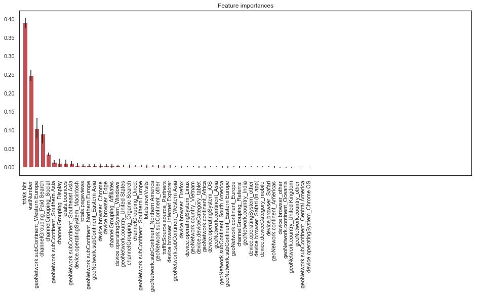

# Capstone-project---Flatiron
Google Merchandise Store Revenue Prediction
https://www.kaggle.com/c/ga-customer-revenue-prediction

# Project Motivation
Most small businesses today have an e-commerce presence and need to analyze what drives revenue on their website/mobile app. That is why this Kaggle competition for the "Google Analytics Customer Revenue Prediction" really spoke to me.

"The 80/20 rule has proven true for many businesses–only a small percentage of customers produce most of the revenue. As such, marketing teams are challenged to make appropriate investments in promotional strategies.

RStudio, the developer of free and open tools for R and enterprise-ready products for teams to scale and share work, has partnered with Google Cloud and Kaggle to demonstrate the business impact that thorough data analysis can have.

In this competition, you’re challenged to analyze a Google Merchandise Store (also known as GStore, where Google swag is sold) customer dataset to predict revenue per customer. Hopefully, the outcome will be more actionable operational changes and a better use of marketing budgets for those companies who choose to use data analysis on top of GA data."

# What question are we trying to answer for the purpose of this project?
Can we predict the revenue of each visit to the Google Merchandise Store? (predicting the revenue for each row of data)

Can we make a recommendation to the owner of this Google Merchandise Store about what features/variables are important when predicting the revenue of each session?

# Features/independent variables:
fullVisitorId- A unique identifier for each user of the Google Merchandise Store.

channelGrouping - The channel via which the user came to the Store.

date - The date on which the user visited the Store.

device - The specifications for the device used to access the Store.

geoNetwork - This section contains information about the geography of the user.

socialEngagementType - Engagement type, either "Socially Engaged" or "Not Socially Engaged".

totals - This section contains aggregate values across the session.

trafficSource - This section contains information about the Traffic Source from which the session originated.

visitId - An identifier for this session. This is part of the value usually stored as the _utmb cookie. This is only unique to the user. For a completely unique ID, you should use a combination of fullVisitorId and visitId.

visitNumber - The session number for this user. If this is the first session, then this is set to 1.

visitStartTime - The timestamp (expressed as POSIX time).

hits - This row and nested fields are populated for any and all types of hits. Provides a record of all page visits.

customDimensions - This section contains any user-level or session-level custom dimensions that are set for a session. This is a repeated field and has an entry for each dimension that is set.

totals - This set of columns mostly includes high-level aggregate data.

# Label/Target variable:
totals.transactionRevenue - We are predicting the natural log of the transaction revenue for each visit to the Google Merchandise Store

# OSEMN Methodology
Obtain, scrub, explore, model, interpret the data

# OBTAIN THE DATA
The data is around 1 million rows by 12 columns provided by Google in this Kaggle competition. The data is also in a zip file with 4 of the columns in a JSON format which required some work arounds. After dealing with the nested JSON columns there ends up being 903,653 rows by 36 columns. 

# SCRUB THE DATA
Dealing with missing values and placeholder values. Ten of the columns had mostly null values. 

# EXPLORE THE DATA

Only 1.274% of the store visits resulted in transaction revenue. 

Normally distributed natural log of revenues

## Initial feature exploration through some visualizations 

# Correlation of features

# Features:
75 features after one-hot encoding categorical variables.

# Principal Component Analysis (PCA)
50 features explains 97% of the variance in the data. This will help to cut down the number of features used in the modeling phase.

# Model
I decided to go with Random Forest Regression because it was a powerful ensemble method that can produce some accurate predictions. My initial model's train set had a MSE of 0.60 which is very good but the validation set's MSE was around 3.5, which tells me my model is severly overfitting the train data and this requires some hyperparameter tuning. 

I used a grid search to try and tune my hyperparameters, n_estimators, criterion, max_depth, min_samples_split, and min_samples_leaf. Unfortunately this grid search took over two hours to run because it is still 50 columns by 1 million rows. The following visualizations gives some insight into how I decided to test different values for my grid search.

For my final model I eventually went with:
n_estimators = 100
criterion = 'mse'
max_depth = 8
min_samples_split = 450
min_samples_leaf=50

My tuned model had a train, validation, and test set MSE of around 2.87. My model appears to be well fit after tuning, but obviously way less accurate than my initial overfit model. The r_2 of my final model was also only around 25.7% which leaves a lot to be desired.

## Feature importances

The top 5 features explains over 76% of the variance of this model. I thought it would make sense to try a random forest regressor model with just these 5 features and compare the MSE and r_2 to my tuned model with 50 features.

The MSE of the model with just 5 features ended up being 3.13 which is only 8% less accurate than the 2.87 MSE of my model with 50 features that is very time consuming to run. 

# Business recommendations

Based on the mean squared error (MSE) of 2.87, and r_2 of 25%, my model doesn't do the best job predicting revenues. There were some other people on Kaggle that used various gradient boosting algorithms that got their MSE down to 1.5, but it seems their model had some serious overfitting going on.

If I had access to cloud computing services like AWS I could run more complex grid searches to tune my parameters even more. Each grid search took over 2 hours to run on my local computer. Also, I would have tried XGBoost or a similar gradient boosting algorithm which usually has pretty good results for regression analysis. I would also try to eliminate more features that are highly correlated in future models. There is a lot of correlation between the location features.

Based on my findings, I would strongly recommend a business to just pay for resources to collect the 5 most important features because the accuracy is only 8% lower. The cost of collecting the data of 50+ features and running a model with 50+ features could be very expensive. It also took my random forest grid search over 2 hours to run, but when I used just 5 features it would run in less than 5 minutes.

Added another line to README.md
