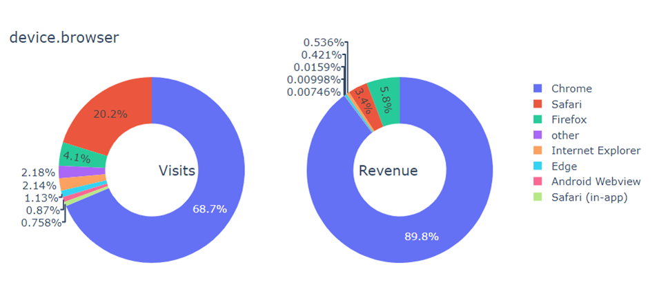

# Capstone-project---Flatiron
Google Merchandise Store Revenue Prediction
https://www.kaggle.com/c/ga-customer-revenue-prediction

# Project Motivation
Most small businesses today have an e-commerce presence and need to analyze what drives revenue on their website/mobile app. That is why this Kaggle competition for the "Google Analytics Customer Revenue Prediction" really spoke to me.

"The 80/20 rule has proven true for many businesses–only a small percentage of customers produce most of the revenue. As such, marketing teams are challenged to make appropriate investments in promotional strategies.

RStudio, the developer of free and open tools for R and enterprise-ready products for teams to scale and share work, has partnered with Google Cloud and Kaggle to demonstrate the business impact that thorough data analysis can have.

In this competition, you’re challenged to analyze a Google Merchandise Store (also known as GStore, where Google swag is sold) customer dataset to predict revenue per customer. Hopefully, the outcome will be more actionable operational changes and a better use of marketing budgets for those companies who choose to use data analysis on top of GA data."

# What question are we trying to answer for the purpose of this project?
Can we predict the revenue of each visit to the Google Merchandise Store? (predicting the revenue for each row of data)

Can we make a recommendation to the owner of this Google Merchandise Store about what features/variables are important when predicting the revenue of each session?

# Features/independent variables:
fullVisitorId- A unique identifier for each user of the Google Merchandise Store.

channelGrouping - The channel via which the user came to the Store.

date - The date on which the user visited the Store.

device - The specifications for the device used to access the Store.

geoNetwork - This section contains information about the geography of the user.

socialEngagementType - Engagement type, either "Socially Engaged" or "Not Socially Engaged".

totals - This section contains aggregate values across the session.

trafficSource - This section contains information about the Traffic Source from which the session originated.

visitId - An identifier for this session. This is part of the value usually stored as the _utmb cookie. This is only unique to the user. For a completely unique ID, you should use a combination of fullVisitorId and visitId.

visitNumber - The session number for this user. If this is the first session, then this is set to 1.

visitStartTime - The timestamp (expressed as POSIX time).

hits - This row and nested fields are populated for any and all types of hits. Provides a record of all page visits.

customDimensions - This section contains any user-level or session-level custom dimensions that are set for a session. This is a repeated field and has an entry for each dimension that is set.

totals - This set of columns mostly includes high-level aggregate data.

# Label/Target variable:
totals.transactionRevenue - We are predicting the natural log of the transaction revenue for each visit to the Google Merchandise Store

# OSEMN Methodology
Obtain, scrub, explore, model, interpret the data

# OBTAIN THE DATA
The data is around 1 million rows by 12 columns provided by Google in this Kaggle competition. The data is also in a zip file with 4 of the columns in a JSON format which required some work arounds. After dealing with the nested JSON columns there ends up being 903,653 rows by 36 columns. 

# SCRUB THE DATA
Dealing with missing values and placeholder values. Ten of the columns had mostly null values. 

# EXPLORE THE DATA

Only 1.274% of the store visits resulted in transaction revenue. 

Normally distributed natural log of revenues

## Initial feature exploration through some visualizations 

# Correlation of features

geoNetwork.continent_Americas             geoNetwork.country_other                    0.621833
geoNetwork.country_other                  geoNetwork.continent_Americas               0.621833
trafficSource.medium_referral             channelGrouping_Organic Search              0.649875
channelGrouping_Organic Search            trafficSource.medium_referral               0.649875
trafficSource.medium_referral             trafficSource.medium_organic                0.649875
trafficSource.medium_organic              trafficSource.medium_referral               0.649875
trafficSource.medium_referral             trafficSource.source_google                 0.678662
trafficSource.source_google               trafficSource.medium_referral               0.678662
trafficSource.medium_referral             trafficSource.source_youtube.com            0.729637
trafficSource.source_youtube.com          trafficSource.medium_referral               0.729637
geoNetwork.country_United States          geoNetwork.country_other                    0.733014
geoNetwork.country_other                  geoNetwork.country_United States            0.733014
device.browser_Safari                     device.browser_Chrome                       0.743782
device.browser_Chrome                     device.browser_Safari                       0.743782
channelGrouping_Social                    trafficSource.medium_referral               0.759939
trafficSource.medium_referral             channelGrouping_Social                      0.759939
geoNetwork.subContinent_Northern America  geoNetwork.country_other                    0.777331
geoNetwork.country_other                  geoNetwork.subContinent_Northern America    0.777331
trafficSource.source_mall.googleplex.com  channelGrouping_Referral                    0.777456
channelGrouping_Referral                  trafficSource.source_mall.googleplex.com    0.777456
geoNetwork.country_United Kingdom         geoNetwork.subContinent_Northern Europe     0.792103
geoNetwork.subContinent_Northern Europe   geoNetwork.country_United Kingdom           0.792103
geoNetwork.continent_Americas             geoNetwork.country_United States            0.825334
geoNetwork.country_United States          geoNetwork.continent_Americas               0.825334
geoNetwork.subContinent_other             geoNetwork.continent_Africa                 0.856200
geoNetwork.continent_Africa               geoNetwork.subContinent_other               0.856200
geoNetwork.subContinent_Northern America  geoNetwork.continent_Americas               0.875456
geoNetwork.continent_Americas             geoNetwork.subContinent_Northern America    0.875456
geoNetwork.subContinent_Southern Asia     geoNetwork.country_India                    0.924022
geoNetwork.country_India                  geoNetwork.subContinent_Southern Asia       0.924022
trafficSource.source_google               channelGrouping_Organic Search              0.927309
trafficSource.medium_organic              trafficSource.source_google                 0.927309
channelGrouping_Organic Search            trafficSource.source_google                 0.927309
trafficSource.source_google               trafficSource.medium_organic                0.927309
geoNetwork.subContinent_Northern America  geoNetwork.country_United States            0.942748
geoNetwork.country_United States          geoNetwork.subContinent_Northern America    0.942748
trafficSource.source_youtube.com          channelGrouping_Social                      0.960126
channelGrouping_Social                    trafficSource.source_youtube.com            0.960126
totals.hits                               totals.pageviews                            0.983204
totals.pageviews                          totals.hits                                 0.983204
channelGrouping_Affiliates                trafficSource.source_Partners               0.999752
trafficSource.source_Partners             trafficSource.medium_affiliate              0.999752
                                          channelGrouping_Affiliates                  0.999752
trafficSource.medium_affiliate            trafficSource.source_Partners               0.999752
